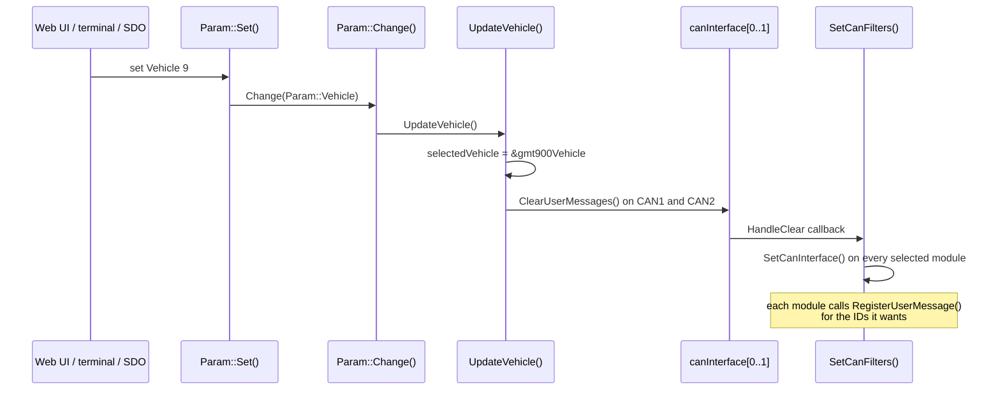

# Architecture and scheduling

The firmware is a single bare-metal C++ program. There is no RTOS. Work happens in three
places:

1. **The scheduler interrupt** (TIM4), which runs four periodic tasks. Almost all vehicle
   logic lives here.
2. **CAN receive interrupts**, which hand every accepted frame to the selected modules'
   `DecodeCAN()` methods.
3. **The `main()` loop**, which only services the terminal UART and CAN SDO requests.

## Boot sequence

`main()` in `src/stm32_vcu.cpp` runs these steps in order:

| Step | Code | What it does |
|---|---|---|
| 1 | `clock_setup()`, `rtc_setup()` | System clocks; RTC with a 1 s interrupt that drives the day/hour/minute clock. |
| 2 | `ConfigureVariantIO()` | Configures every pin in `DIG_IO_LIST` and `ANA_IN_LIST`, starts ADC DMA. |
| 3 | `gpio_primary_remap(...)` | JTAG off (SWD stays on), CAN2 and TIM1 remapped. |
| 4 | `usart2_setup()` | Toyota hybrid inverter sync-serial link. |
| 5 | `nvic_setup()` | Interrupt enables and priorities (see below). |
| 6 | `parm_load()` | Loads saved parameters from the last flash page, if the CRC matches. |
| 7 | `spi2_setup()`, `spi3_setup()`, `tim3_setup()` | CAN3 controller (SPI2), digital pots (SPI3), PWM outputs (TIM3). |
| 8 | `Param::Change(Param::PARAM_LAST)` | Pushes all parameters into the throttle, I/O matrix, charge timer and preheater. |
| 9 | Pin setup | Inverter power off, CAN3 out of standby, CAN1 transceiver enabled (V1.3 hardware). |
| 10 | `Terminal t(USART3, ...)` | Serial command line. |
| 11 | `Stm32Can c(CAN1, Baud500)`, `c2(CAN2, Baud500, true)` | Both on-chip CAN controllers at **500 kbit/s, fixed**. |
| 12 | `CanMap cm(...)`, `CanSdo sdo(&c, &cm)` | User CAN map on the bus chosen by `CanMapCan`; SDO server on **CAN1, node ID 3**. |
| 13 | `c.AddCallback(&cb)`, `c2.AddCallback(&cb)` | Both buses deliver frames to `CanCallback()` and call `SetCanFilters()` whenever user messages are cleared. |
| 14 | `CANSPI_Initialize()` | Third CAN port (MCP25625). |
| 15 | `LinBus l(USART1, 19200)` | LIN bus for VW heaters. |
| 16 | `UpdateInv()` … `UpdateShifter()` | Select one module of each kind from the parameters. Each call clears user CAN messages, which re-runs `SetCanFilters()`. |
| 17 | `Stm32Scheduler s(TIM4)` + four `AddTask()` | Start the 1/10/100/200 ms tasks. |
| 18 | `ISA::initialize()` | Only if `IsaInit` = 1. |
| 19 | `opmode = MOD_OFF` | Always boot into Off. |
| 20 | `while (1)` | Terminal and SDO servicing forever. |

## The scheduler

`Stm32Scheduler` (libopeninv) runs TIM4 at 100 kHz and uses its four output-compare
channels, one per task. **It supports at most four tasks and the VCU uses all four**, so
a new periodic job must go into an existing task (count ticks if you need another rate;
see [the GMT900 example](gmt900-example.md#timing-80-hz-frames)).

All four tasks run **inside the TIM4 interrupt handler**, in channel order. They do not
preempt each other: if the 200 ms task takes 3 ms, the 1 ms task waits. Each task's
execution time feeds the `cpuload` spot value.

| Task | Period | Core work (in order) |
|---|---|---|
| `Ms1Task` | 1 ms | `Task1Ms()` on the inverter, vehicle, charger, charge interface, shifter and DC-DC. Nothing else. |
| `Ms10Task` | 10 ms | Charge interface `Task10Ms()`; in Run, the [throttle pipeline](throttle.md) and inverter `Task10Ms()`; `SetTorque()` on the inverter (0 outside Run); regen brake light; read motor `speed`; `GetDigInputs()`; tacho via `SetRevCounter()` (Run/Charge only); `SetTemperatureGauge()`; vehicle, DC-DC, shifter and (in Charge) charger `Task10Ms()`; `canctr`; `ProcessUdc()`; status bits; the [opmode state machine](state-machine.md); cabin heater; SBOX/VW box contactor control. |
| `Ms100Task` | 100 ms | Toggle LED; **feed the watchdog**; CPU load; `SelectDirection()`; SOC; cruise; `Task100Ms()` on inverter, vehicle, charger, BMS, DC-DC, shifter, heater; `canMap->SendAll()`; Outlander heartbeat; reverse and run lights; copy inverter temperatures/state/voltage to params; `T15Stat`; DC fast charge and AC request logic; heater request input; HV request input; HVIL; cooling fan; HV-active and shift-lock outputs. |
| `Ms200Task` | 200 ms | Vehicle `Task200Ms()`; charger `Task200Ms()` in Charge; charge interface `Task200Ms()`; CP spoof PWM; clock params; charge timer and `RunChg`; proximity pilot; AC charger `ControlCharge()`; charge termination; brake vacuum pump; preheater. |

!!! note "Watchdog"
    The independent watchdog is fed only in `Ms100Task`. Code that blocks a task for long
    enough will reset the board.

## Interrupt priorities

Lower number means higher priority on the Cortex-M3. Values from `hwinit.cpp`
`nvic_setup()` and the `Stm32Can` constructor (which runs later and wins for CAN):

| Interrupt | Priority | Notes |
|---|---|---|
| TIM4 (scheduler, all four tasks) | `0x00` (highest) | |
| EXTI15_10 (CAN3 / MCP25625 RX) | not set (defaults to `0x00`) | |
| RTC second tick | `0x20` | |
| CAN1 and CAN2 RX/TX | `0xF0` (lowest) | Set in `Stm32Can` constructor |
| USART2 DMA (Toyota link) | `0xF0` | |

Consequences for module authors:

- **`DecodeCAN()` runs in a CAN interrupt at the lowest priority.** A scheduler task can
  preempt it half way through. Values written by `DecodeCAN()` and read by a task can
  be seen half-updated. Single aligned 8/16/32-bit stores are atomic on Cortex-M3, so
  store each decoded value in one variable; if several fields must be consistent, copy
  them with interrupts briefly disabled or use a sequence flag.
- Keep `DecodeCAN()` short. It is called for every accepted frame on both buses.
- `Task1Ms()` runs every millisecond inside the highest-priority interrupt. Anything
  slow there (floating point loops, many `Param::` lookups, sending lots of frames)
  steals time from everything else.

## Where data lives

There are almost no globals shared between modules. Modules talk to the core through:

- **The parameter database.** `Param::GetInt/GetFloat/GetBool` to read settings and
  spot values, `Param::SetInt/SetFloat` to publish results (for example
  `Param::Veh_Speed`). See [Parameter system](parameters.md).
- **Their base-class methods.** For example, the core calls `GetMotorSpeed()` on the
  inverter and passes the result to `SetRevCounter()` on the vehicle.
- **`IOMatrix`** for user-assigned pins, and `DigIo::`/`AnaIn::` for fixed pins.

## Module selection



Every `UpdateX()` calls `DeInit()` on the old module (where the base class has it),
switches the pointer, and clears user messages on both buses. Clearing triggers
`SetCanFilters()`, which calls `SetCanInterface()` on **every** selected module with the
bus chosen by its `...Can` parameter. That is why modules register their receive IDs in
`SetCanInterface()`: it is re-run whenever anything changes.

`SetCanFilters()` also registers the shunt or contactor-box IDs and `0x601` on both buses.

## The main loop

```cpp
while (1) {
  t.Run();                                  // terminal UART
  if (sdo.GetPrintRequest() == PRINT_JSON)
    TerminalCommands::PrintParamsJson(&sdo, &c);
  if (sdoFrame) {                           // SDO request queued by the CAN ISR
    SdoCommands::ProcessStandardCommands(sdoFrame);
    sdo.SendSdoReply(sdoFrame);
  }
}
```

Saving parameters (`save`) runs here and disables interrupts while flash is written, so
the tasks stop for that time. Saving is never blocked by the VCU's opmode in this
firmware, so avoid saving while driving.
