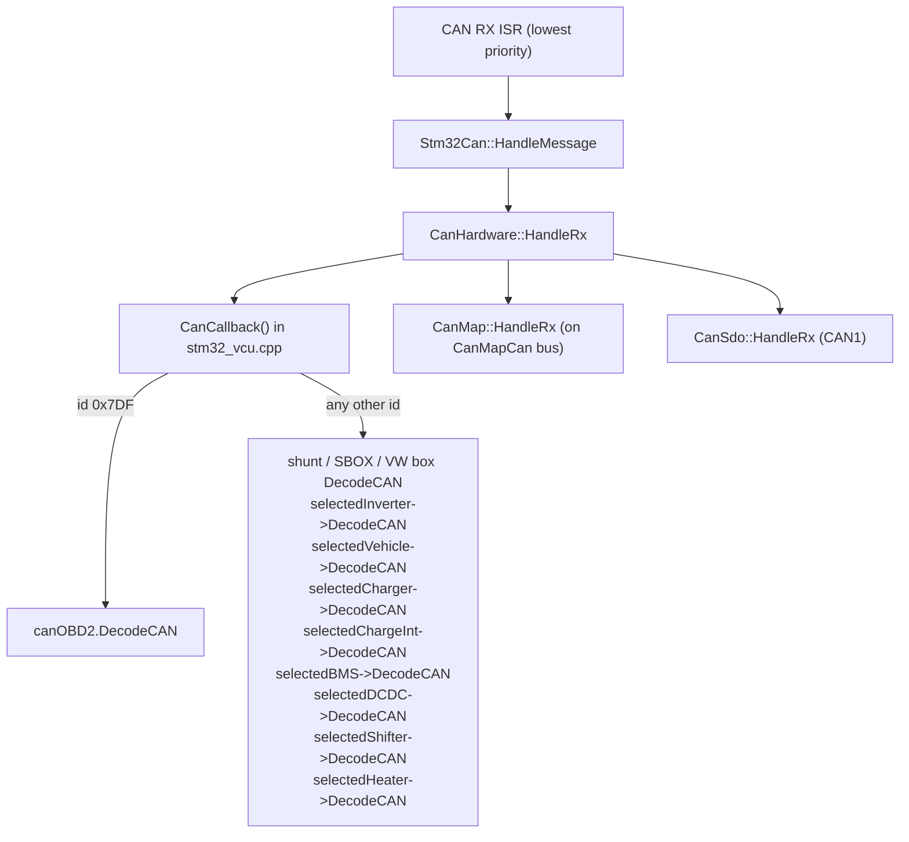

# CAN subsystem

## The three CAN ports

| Port | Hardware | Bit rate | Driver | Who can use it |
|---|---|---|---|---|
| CAN1 | STM32 bxCAN1 | 500 kbit/s, fixed in `main()` | `Stm32Can` (libopeninv) | Any module, chosen with its `...Can` parameter (0 = CAN1). SDO server lives here. |
| CAN2 | STM32 bxCAN2 (remapped pins) | 500 kbit/s, fixed in `main()` | `Stm32Can` | Any module (1 = CAN2). |
| CAN3 | MCP25625 on SPI2, IRQ on PE15 | 33.3k / 500k / 100k (`CAN3Speed`) | `CANSPI.cpp`, `MCP2515.cpp` | In V2.41A, only IDs 0x108/0x109 are passed on, to the charge interface. |

`canInterface[0]` and `canInterface[1]` in `stm32_vcu.cpp` point at CAN1 and CAN2. The
`...Can` parameters are `CAN_DEV` enums with values 0 and 1 only, so **a module can only
be placed on CAN1 or CAN2**. Using CAN3 for anything else needs code (see
[Known issues](known-issues.md#can3-is-almost-unused)).

To run CAN1 or CAN2 at a rate other than 500 kbit/s, change the `Stm32Can` constructor
arguments in `main()` (`CanHardware::Baud125` … `Baud1000`).

## Receiving

### Receive filters

The bxCAN hardware only accepts IDs that are in its filter banks. Nothing reaches your
code unless an ID was registered:

```cpp
void MyVehicle::SetCanInterface(CanHardware *c) {
  can = c;
  can->RegisterUserMessage(0x1F5);          // standard ID
  can->RegisterUserMessage(0x18FF50E5);     // extended (anything > 0x7FF)
  can->RegisterUserMessage(0x20000000 | 0x100); // force extended for a small ID
  can->RegisterUserMessage(0x100, 0x7F0);   // ID + mask: 0x100..0x10F
}
```

- Each interface holds at most **`MAX_USER_MESSAGES` = 30** registrations (set in the
  Makefile). `RegisterUserMessage()` returns false when full or when the ID is already
  registered, and nothing else tells you. Add up what every module on a bus registers.
- `ClearUserMessages()` empties the list and calls every registered callback's
  `HandleClear()`. In this firmware that callback is `SetCanFilters()`, which calls
  `SetCanInterface()` on all selected modules again; `CanMap` and `CanSdo` re-register
  their own IDs the same way.
- Register in `SetCanInterface()`, not in a constructor or a task, so your IDs come back
  after every clear.

### Dispatch



Two things follow from `CanCallback()`:

1. **Every selected module sees every accepted frame from both buses.** The callback
   does not pass the bus number. If two modules use the same ID on different buses,
   both decode both. Filter on ID inside `DecodeCAN()`, and avoid IDs another selected
   module also uses.
2. `DecodeCAN()` receives `uint32_t data[2]` (or `uint8_t*` for BMS and DC-DC). Cast to
   bytes with `uint8_t *bytes = (uint8_t *)data;`. `bytes[0]` is the first byte on the
   wire. The DLC is not passed to modules.

`DecodeCAN()` runs in interrupt context; see
[Architecture](architecture.md#interrupt-priorities) for the rules.

## Sending

```cpp
uint8_t bytes[8] = {0};
bytes[0] = 0x12;
can->Send(0x1F5, bytes, 8);        // uint8_t[8] overload with length

uint32_t data[2] = {0x04030201, 0x08070605};
can->Send(0x3F, data);             // uint32_t[2] overload, length 8
```

- IDs above `0x7FF` are sent as extended frames automatically.
- `Send()` tries a free hardware mailbox (there are three). If all are busy, the frame
  goes into a **20-entry software queue** (`SENDBUFFER_LEN`), drained by the TX-empty
  interrupt. If the queue is also full the frame is **dropped silently**.
- The queue is drained from the end (last in, first out), so frames queued during a
  burst may go out in a different order than you sent them. Don't rely on ordering
  between frames of one burst.
- `can` is the `CanHardware*` the core gave your module in `SetCanInterface()`. Send
  from your task methods. Sending from `DecodeCAN()` works but runs in the ISR.

## CanMap

`CanMap` (libopeninv) lets the user map any parameter to or from a CAN frame without
code. One `CanMap` instance exists, on the bus chosen by `CanMapCan` at **boot**.

Terminal syntax:

```text
can tx <param> <id> <startbit> <length> <gain> [offset]
can rx <param> <id> <startbit> <length> <gain> [offset]
can print
can del <param>
can clear
```

- `length` in bits; a negative length means big-endian (Motorola) byte order.
- `gain` may have decimals; `offset` is a signed 8-bit integer.
- Limits (`canmap.h`): 10 TX frame IDs, 10 RX frame IDs (`MAX_MESSAGES`), and 50
  mapped items in total (`MAX_ITEMS`).
- TX maps are sent by `canMap->SendAll()` in `Ms100Task`, so **every mapped frame goes
  out at 10 Hz**. Faster frames need code.
- RX maps write straight into the parameter, which is a quick way to feed `udc`, a
  temperature or `canio` from another controller.
- `save` stores the map in its own flash pages along with parameters.

## CAN SDO

`CanSdo` gives CANopen-style expedited SDO access on **CAN1** with node ID 3
(requests on `0x603`, responses on `0x583`). Indexes used by libopeninv:

| Index | Purpose |
|---|---|
| `0x2000`, sub-index *n* | Parameter by list position |
| `0x21hh`, sub-index `ll` | Parameter by ID `0xhhll` |
| `0x3000` / `0x3001` | Add CAN map TX / RX entry |
| `0x3100` | Read CAN map |
| `0x5000` | Serial number and commands (save, load, reset, defaults) |
| `0x5001` | Option strings |
| `0x5003` / `0x5004` | Error log number / time |

The OpenInverter web interface and tools can talk to the VCU this way over a CAN
adapter. The `Can_OI` and `Foccci` drivers are SDO *clients*: they configure their
target over SDO.

## OBD2

`Can_OBD2` answers functional requests on `0x7DF` on the `OBD2Can` bus, so a generic
OBD2 reader can show some values. It is always active; no selection parameter.

## Checklist for a new CAN module

- [ ] Register every receive ID in `SetCanInterface()`.
- [ ] Count registrations on the bus you expect users to choose; stay under 30.
- [ ] Check [CAN IDs by module](../reference/can-ids.md) for collisions.
- [ ] Keep `DecodeCAN()` short and write each decoded value in a single store.
- [ ] Send periodic frames from a task, using a tick counter for rates the four tasks
      do not provide.
- [ ] Implement any timeout (stale data) in a task: count down, reset in `DecodeCAN()`.
