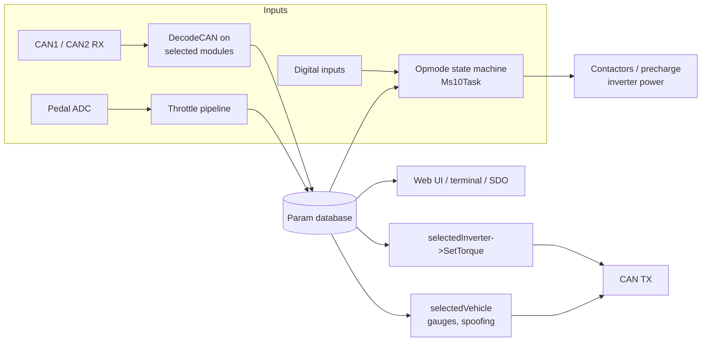

# Developer Guide

This half of the documentation is for anyone who wants to change the firmware: fix a
bug, add support for a new car, inverter, BMS or charger, or maintain a private fork.

## Start here

1. [Building, testing and flashing](build.md) gets a binary out of the source in a few
   minutes.
2. [Repository layout](repo-layout.md) tells you where things live.
3. [Architecture and scheduling](architecture.md) explains the boot sequence, the four
   periodic tasks and the interrupt priorities. Read it before writing any code that
   runs on a timer or touches CAN.
4. [Module interfaces](interfaces.md) describes the eight plug-in base classes
   (`Vehicle`, `Inverter`, `BMS`, `Chargerhw`, `Chargerint`, `Heater`, `DCDC`,
   `Shifter`) and exactly when the core calls each method.
5. [Adding a vehicle class](adding-a-vehicle.md) is a complete, compile-tested walkthrough.
   [Worked example: GM GMT900](gmt900-example.md) applies it to a car that needs
   ECM/TCM frames spoofed on its CAN bus.

## The design in one paragraph

`src/stm32_vcu.cpp` owns everything. It creates one static instance of every supported
module, keeps a pointer to the *selected* one of each kind (`selectedVehicle`,
`selectedInverter`, …), and swaps those pointers when the user changes the matching
parameter. A hardware timer runs four tasks at 1, 10, 100 and 200 ms; each task calls the
matching `TaskXMs()` method on the selected modules, then runs the core logic: throttle,
the operating-mode state machine, contactor sequencing, charging and I/O. Received CAN
frames are offered to every selected module's `DecodeCAN()`. All shared state lives in
the parameter database (`Param::`), which is also what the web interface, terminal and
CAN SDO read and write.

