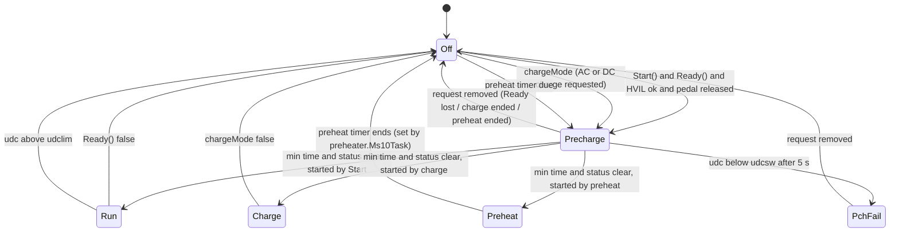

# Operating-mode state machine

The `opmode` spot value is the VCU's top-level state. The state machine is the `switch
(opmode)` at the end of `Ms10Task()` in `src/stm32_vcu.cpp`, so it advances every 10 ms.
`ProcessUdc()` can also force `MOD_OFF` from anywhere on over-voltage.



## The states

| Value | Name | Outputs and behaviour |
|---|---|---|
| 0 | `MOD_OFF` | Inverter power off, coolant pump off, `dir` forced to 0, `DashOff()` on the vehicle. After `rlyDly` ticks (25 = 250 ms from boot, 300 = 3 s after Run/Charge) the main contactor, negative contactor and precharge open, and the charger gets `Off()`. |
| 2 | `MOD_PRECHARGE` | Negative contactor and coolant pump on. Inverter power on, except for `OpenI` and except in charge mode (Leaf inverter with no shunt is the exception, because its voltage is the precharge reference). After `rlyDly` (250 ms) the precharge relay closes. |
| 3 | `MOD_PCHFAIL` | Precharge relay forced open. Posts `PRECHARGE` error. Stays here until the request goes away. |
| 1 | `MOD_RUN` | After `rlyDly` the main contactor and inverter power turn on. Throttle and `SetTorque()` are active. Errors are un-posted each cycle. |
| 4 | `MOD_CHARGE` | After `rlyDly` the main contactor closes. Throttle is zero. |
| 5 | `MOD_PREHEAT` | After `rlyDly` the main contactor closes; `preheater.Ms10Task()` runs. |

## Leaving Off

From `MOD_OFF`, three things start a precharge (each sets `rlyDly = 25` and records the
start time):

1. **Drive start:** `pot < potmin` (pedal released) **and** `selectedVehicle->Start()`
   **and** `selectedVehicle->Ready()` **and** HVIL ok. The default `Start()` returns
   `din_start` (the start input pin or CAN io bit). `Ready()` is pure virtual; the
   no-vehicle class returns the T15 ignition pin.
2. **Charge:** `chargeMode` is true. It is set in `Ms200Task` when the selected charger's
   `ControlCharge(RunChg, ACrequest)` returns true, and in `Ms100Task` when the charge
   interface's `DCFCRequest()` returns true or the HV request input is on.
3. **Preheat:** the preheater timer is due.

!!! note "Pedal check uses raw ADC and a strict comparison"
    The start condition is `pot < potmin` on the raw ADC value. With the default
    `potmin = 0` it can never be true, so the car will not start until the throttle is
    calibrated. Set `potmin` a little *above* the released-pedal reading so ADC noise
    cannot block the start. The check assumes the reading rises with pedal travel. With
    an inverted pedal (reading falls as you press) a pressed pedal also satisfies
    `pot < potmin`, so the "pedal released" interlock does nothing. Prefer a pedal whose
    reading rises with travel.

## Finishing precharge

The precharge exit condition, checked every 10 ms:

```cpp
(prechargeMinTime == 0) &&
(stt & (STAT_POTPRESSED | STAT_UDCBELOWUDCSW | STAT_UDCLIM)) == 0
```

- `prechargeMinTime` starts at 100 (1 s) **once at boot** and is not reset, so only the
  first precharge after power-up waits the full second.
- `STAT_UDCBELOWUDCSW` is set while `udc < udcsw`. **Something must put the DC-link
  voltage into `udc`:** a shunt (`ShuntType` 1–4), the Leaf inverter driver, the
  Outlander charger driver, or a CAN `rx` map. With `ShuntType = 0` and an OpenInverter
  drive unit, `udc` stays at 0 and precharge always fails unless you map it from CAN.
- `STAT_POTPRESSED` is set while `pot > potmin`.
- `STAT_UDCLIM` is set while `udc >= udclim`.

If `udc` is still below `udcsw` 5 RTC seconds (`PRECHARGE_TIMEOUT`) after the start, the
precharge relay opens, `PRECHARGE` is posted and the state becomes `MOD_PCHFAIL`. Which
of Run, Charge or Preheat follows depends on what started the precharge (`StartSig`,
`chargeMode`, preheater).

## Contactor timing

`rlyDly` staggers relays so they do not all pull in at once:

| Transition | `rlyDly` | Then |
|---|---|---|
| Off → Precharge | 25 (250 ms) | Precharge relay closes |
| Precharge → Run/Charge/Preheat | 25 (250 ms) | Main contactor closes (and inverter power in Run) |
| Run/Charge → Off | 300 (3 s) | Contactors open; gives the inverter time to stop |

The negative contactor is an [I/O matrix](io.md) output (`NegContactor`). The main
contactor (`dcsw_out`, pin PC7), precharge (`prec_out`, PC6) and inverter power
(`inv_out`, PA8) are fixed pins. With `ShuntType` = SBOX or VAG the contactor box is
also commanded over CAN with the same opmode.

## Safety exits

- **Over-voltage:** `ProcessUdc()` sets `MOD_OFF` and posts `OVERVOLTAGE` whenever
  `udc > udclim`. If the motor is turning slower than 50 rpm it also opens the main and
  precharge contactors immediately, because the over-voltage must be coming from outside.
- **Ignition off:** in Run, `Ready()` returning false goes to Off.
- **HVIL:** checked only when leaving Off. An HVIL fault while running posts
  `HVILERR` but does not stop the car.
- **Errors in Run:** `ErrorMessage::UnpostAll()` runs every 10 ms in Run and Charge, so
  `lasterr` shows the most recent error but the active list is cleared.
