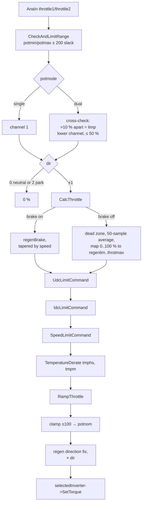

# Throttle pipeline

In `MOD_RUN`, every 10 ms, `Ms10Task()` turns pedal position into a torque request in
percent (−100 to +100) and hands it to `selectedInverter->SetTorque()`. Outside Run the
request is 0 and only `pot`/`pot2` are updated so you can calibrate.

## Steps

`utils::ProcessThrottle(speed)` (in `utils.cpp`) drives the pipeline; the math is in
`Throttle::` (`throttle.cpp`). Settings are copied into `Throttle::` statics by
`Param::Change()`.

1. **Ramp selection.** Below `throtramprpm` the ramp is `throtramp`; above it the ramp
   is the parameter's maximum (effectively unlimited).
2. **Read and check** (`GetUserThrottleCommand`). A channel is out of range if it is
   more than 200 counts beyond its calibrated span; it is then clamped to its minimum and
   an error is posted (only in Run). In dual mode the channels are normalised and
   compared; more than 10 % apart selects the lower one and caps it at 50 %.
3. **Direction gate.** Neutral (0) or Park (2) returns 0.
4. **`CalcThrottle`:**
    - Brake on: return `regenBrake`, tapered linearly to 0 between `regenrpm` and
      `regenendrpm`, and 0 below 100 rpm.
    - Brake off: normalise to 0–100 %, apply `throtdead` (and rescale the rest), average
      over the last 50 samples unless the pedal moved more than 1 % from the average,
      then map 0–100 % onto `regenlim`…`throtmax` (or `throtmaxRev` in reverse;
      `revRegen` = 0 removes regen in reverse). `regenlim` is `regenmax` tapered by
      speed the same way as brake regen. So **lift-off regen is the bottom of pedal
      travel**: 0 % pedal gives `regenmax`.
5. **Limits**, each only reducing the request:
    - `UdcLimitCommand`: drive torque falls off as `udc` approaches `udcmin`
      (3.5 % per volt), regen falls off above `udclim`. Disabled if `udcmin` = 0.
    - `IdcLimitCommand`: filtered `idc` against `idcmax`/`idcmin`. Disabled if
      `idcmax` = 0.
    - `SpeedLimitCommand`: drive torque falls to 0 at `revlim` (gain 1 % per 4 rpm).
    - `TemperatureDerate`: 50 % for the first 2 °C over `tmphsmax`/`tmpmmax`, 0 above.
    - Each limit ORs its reason into `TorqDerate`.
6. **`RampThrottle`:** clamps to `throtmin`…`throtmax`, ramps increases at
   `throttleRamp` (`throtramp`) and regen build-up at `regenramp`. Reductions in positive
   torque are immediate.
7. **Clamp** to ±100 and publish as `potnom`.

Back in `Ms10Task`, for every inverter **except OpenInverter**, negative (regen) torque
is flipped if the car is rolling opposite to the selected direction, so "regen" never
accelerates the car the wrong way. Then the request is multiplied by `dir`.

## OpenInverter is different

With `Inverter = OpenI`, `Can_OI::SetTorque()` stores the request in `torque` for
display only. What it actually sends in frame `0x3F` every 10 ms in Run is:

| Bits | Content |
|---|---|
| 0–11 | raw `pot` |
| 12–23 | raw `pot2` |
| 24–29 | canio: start (bit 25, held for 3 s on entering Run), brake (26), forward (27), reverse (28) |
| 30–31 | counter |
| 46–47 | counter |
| 48–55 | regen preset, fixed 100 |
| 56–63 | Low 8 bits of the STM32 hardware CRC-32 over both 32-bit words (with this byte still 0) |

So with an OpenInverter board, **the inverter does its own throttle mapping, regen and
limits** from its own `potmin`/`potmax` and related parameters. The VCU's throttle
parameters, derates and ramps above do not reach the motor. Calibrate the pedal on the
OI board as well. The VCU's own `potmin` still matters for the start interlock.

## Brake light from regen

`Ms10Task` sets the `BrakeLight` I/O function when `potnom < RegenBrakeLight`.

## Unit tests

`test/test_throttle.cpp` covers dead zone, brake behaviour and temperature derate. Run
them with `make Test && ./test/test_vcu` after any change here.
