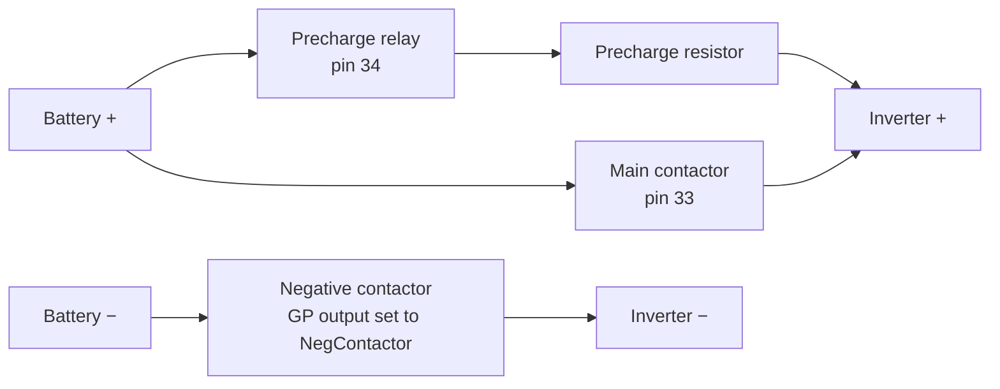

# Hardware and wiring

The authoritative hardware files (schematics, PCB, BOM, Gerbers) are in the firmware
repository's [`Hardware/Zombie`](https://github.com/damienmaguire/Stm32-vcu/tree/master/Hardware/Zombie)
folder. The pin list below comes from `ZOM_V1_HEADER_PINOUT.ods` in that folder, which
describes the V1 board. **Check it against the schematic for your board revision
(the current one is V1.3) before wiring.** A separate relay board, `Zombie_Relays`, is
also documented there.

## The connector

The full 56-pin list is on the [Connector pinout](../reference/pinout.md) page. The
pins you will wire on almost every build:

| Pin | Function | Notes |
|---|---|---|
| 56 | Permanent +12 V | Through a 5 A fuse. |
| 55 | Ground | Chassis ground. |
| 15 | Ignition T15 in | 12 V when the key is on. |
| 52 | Start | Momentary 12 V from the key's start position, or a start button. |
| 49 | Brake input | 12 V from the brake light switch. |
| 54 / 53 | Forward / Reverse | Pull to 12 V; behaviour depends on `dirmode`. |
| 48 / 45 | +5 V / ground for throttle | Hall-effect pedal supply. |
| 47 / 46 | Throttle 1 / Throttle 2 | Pedal signals, 0–5 V. |
| 34 | Precharge | Low-side switch for the precharge relay. |
| 33 | Main contactor | Low-side switch for the main contactor. |
| 32 | Inverter power | Low-side switch for the inverter's 12 V relay. |
| 44 / 43 | CAN1 H / L | 500 kbit/s, 120 Ω terminated on the board. |
| 28 / 27 | CAN2 H / L | 500 kbit/s, 120 Ω terminated on the board. |
| 26 / 25 | CAN3 H / L | Mode set by jumpers (high-speed, single-wire or fault-tolerant). |
| 31, 4, 3 | GP Out 1, 2, 3 | Protected low-side switches. Function set by `Out1Func`…`Out3Func`. |
| 7, 6, 5 | PWM 1, 2, 3 | Push-pull 12 V outputs. Function set by `PWM1Func`…`PWM3Func`. |
| 9, 8 | Analogue 1, 2 | 0–5 V inputs. Function set by `GPA1Func`, `GPA2Func`. |
| 50 | GP 12 V input | Function set by `GP12VInFunc`. |
| 51 | HV request input | Function set by `HVReqFunc`. |
| 1 / 2 | RS232 Rx / Tx | Terminal UART (USART3), used by the Wi-Fi module. |

Low-side outputs switch the ground side of a relay or contactor coil. Feed the coil's
other side from switched +12 V and fit a flyback diode if the coil does not have one.

!!! note "V1 pre-release note"
    The pinout file notes that some highlighted connections were not routed on
    pre-release hardware (workaround: use a GP analogue input for temperature and the GP
    12 V input for the brake light). Release hardware fixes this.

## CAN buses

The board has three CAN ports. In V2.41A:

- **CAN1 and CAN2** both run at **500 kbit/s**. Each device the VCU talks to (inverter,
  BMS, charger, shunt, car, …) can be put on either one with its `...Can` parameter.
- **CAN3** only serves a few charge-interface messages. Treat it as unavailable for
  general use.

Plan which device goes on which bus before wiring:

- Put the **car's own bus** on its own channel if you can. Every device driver in the VCU
  sees every message from both buses, and an ID clash between the car and, say, the
  inverter or a charger can cause dangerous behaviour.
- The VCU's configuration-over-CAN (SDO) and the OpenInverter board configuration both
  run on **CAN1**.
- A CAN bus needs exactly two 120 Ω terminators, one at each end, which measures about
  60 Ω between H and L with power off. Both on-board CAN1/CAN2 terminators are fitted by
  default. If the VCU is not at the end of a bus (for example when tapping into a car's
  existing bus), remove its terminator for that channel.

## High-voltage contactor wiring

The VCU drives three HV functions itself, plus an optional negative contactor:

Sequence (details in [Operating modes](operating-modes.md)):

1. Negative contactor closes.
2. 250 ms later the precharge relay closes.
3. When the measured voltage `udc` reaches `udcsw` (and at least 1 s has passed after
   power-up), 250 ms later the main contactor closes.
4. Shutting down, the contactors open 3 s after the VCU leaves Run or Charge.

Precharge **needs a voltage measurement**: an ISA shunt, a BMW S-box or VW e-box, the
Nissan Leaf inverter, or a value mapped from CAN. Without one, precharge always fails.

## 12 V supply and grounding

- Feed pin 56 from a permanent, fused 12 V so the VCU can run timers and charging with
  the key off.
- `uaux` shows the 12 V supply as the VCU measures it. If it reads well below your
  battery voltage, check grounds.
- The VCU does not switch itself off. Draw from the 12 V battery continues while the
  board is powered.
