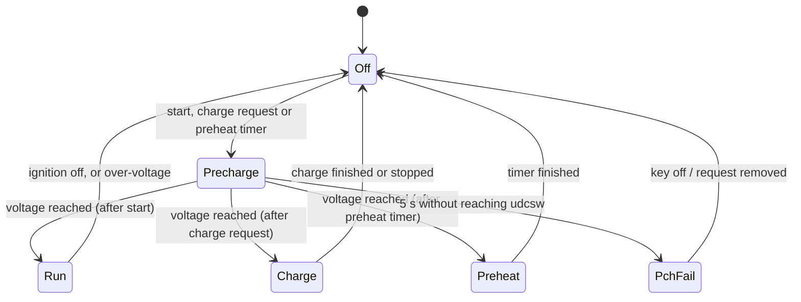

# Operating modes

The `opmode` value tells you what the VCU is doing.

| `opmode` | Name | Meaning |
|---|---|---|
| 0 | Off | HV contactors open. Waiting for start, a charge request or a preheat timer. |
| 2 | Precharge | Negative contactor and precharge relay closed, waiting for `udc` to reach `udcsw`. |
| 1 | Run | Main contactor closed, inverter powered, throttle active. |
| 4 | Charge | Main contactor closed for AC or DC charging. No throttle. |
| 5 | Preheat | Main contactor closed to run the heater on a timer. |
| 3 | PchFail | Precharge did not reach `udcsw` within 5 s. Contactors open. |

## Starting to drive

All of these must be true at once, in Off:

1. The accelerator is released: `pot` is **below** `potmin`.
2. The vehicle reports **start** (by default the start input, `din_start`).
3. The vehicle reports **ignition on** (`T15Stat`).
4. If an input is set to `HVIL`, that input is high.

Then precharge runs, and the VCU enters Run once:

- `udc` ≥ `udcsw`,
- `udc` < `udclim`,
- the pedal is still released,
- and, on the first start after power-up, at least 1 s has passed.

!!! tip "Releasing the start key"
    You only need to hold start until precharge begins. The VCU remembers that the
    precharge was started by a drive request.

## Stopping

- Turning the ignition off in Run returns to Off. The contactors open **3 s later**, giving
  the inverter time to stop.
- Over-voltage (`udc` > `udclim`) forces Off immediately, and if the motor is stopped the
  contactors open at once.
- In Off, `dir` is forced to neutral regardless of the selector.

## Charging

A charge request (from the charger, the DC charge interface, or the HV request input)
starts a precharge from Off. When charging ends the VCU returns to Off and opens the
contactors after 3 s. See [Charging](charging.md).

You cannot start charging from Run: the AC charge request is ignored while in Run.

## What each mode switches

| Output | Off | Precharge | Run | Charge | Preheat |
|---|---|---|---|---|---|
| Negative contactor (`NegContactor`) | off | on | on | on | on |
| Precharge relay (pin 34) | off | on (after 250 ms) | stays on | stays on | stays on |
| Main contactor (pin 33) | off | off | on (after 250 ms) | on (after 250 ms) | on (after 250 ms) |
| Inverter power (pin 32) | off | on (not for OpenInverter or while charging) | on | as precharge | as precharge |
| `CoolantPump` | off | on | on | on | on |
| `HvActive` | off | off | on | on | on |
| `RunIndication` | off | off | on | off | off |
