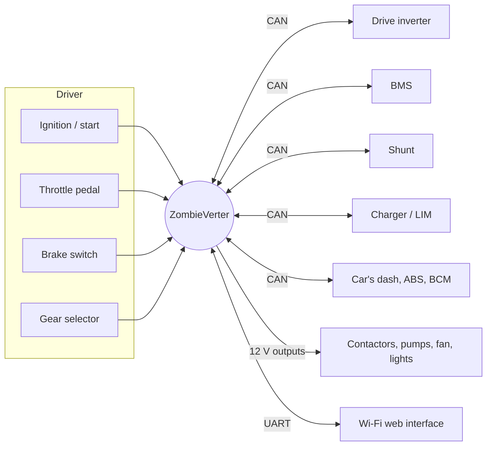

# What the ZombieVerter does

A conversion puts parts from several different cars into one vehicle: a drive unit from
one maker, batteries from another, a charger from a third, all in a car that still
expects its petrol engine. None of them know how to talk to each other. The ZombieVerter
is the translator and the boss:

- **Drive control.** Reads the accelerator pedal, brake switch and gear selection, and
  commands torque from the drive inverter, including regenerative braking.
- **High-voltage safety sequencing.** Closes the negative contactor, precharges the
  inverter's capacitors through a resistor, then closes the main contactor, and opens
  everything again in the right order. Watches for over-voltage and precharge failure.
- **Charging.** Controls an on-board AC charger and, with a suitable interface, DC fast
  charging (CCS through a BMW i3 LIM or FOCCCI board, or CHAdeMO). Ends charging at a
  target voltage, on a timer, or when the BMS says stop.
- **Keeping the original car happy.** Drives the tachometer, temperature and fuel gauges,
  reads the ignition and start signals, and on supported cars sends the CAN messages the
  dashboard, ABS and other modules expect from the missing engine computer.
- **Accessories.** Coolant pumps, radiator fan, brake vacuum pump, cabin heater, DC-DC
  converter, reverse and brake lights, through configurable outputs.

## Supported components (V2.41A)

| Kind | Supported |
|---|---|
| Drive inverters | Nissan Leaf Gen1/2/3, Lexus GS450h and GS300h, Toyota Prius/Yaris/Auris Gen3, Mitsubishi Outlander front and rear, **any OpenInverter board** (Tesla LDU/SDU, others) |
| Vehicles | BMW E46, E39, E65/E6x, E31; mid-2000s VW/Audi; Subaru; "Classic" (no CAN, pulse tacho and PWM gauges) |
| BMS | SimpBMS, TI daisy-chain BMS (single or dual), Nissan Leaf, Renault Kangoo 33 |
| Current sensors | ISA IVT-S shunt, BMW i3 S-box, VW e-box |
| AC chargers | Nissan Leaf PDM, Tesla Gen2 with OI board, Chevy Volt/Opel Ampera, Mitsubishi Outlander, Elcon, any charger switched by a digital output |
| DC charging | BMW i3 LIM (CCS), FOCCCI (CCS), CHAdeMO, CPC |
| Heaters | Ampera/Volt, VW coolant (LIN), VW air (LIN), Outlander (CAN), MG coolant |
| DC-DC | Tesla Gen2, Elcon |
| Gear levers | BMW F30, BMW E65, Jaguar Land Rover G1 and G2 |

If your car is not listed, the VCU still works with the **None** vehicle setting: you wire
ignition, start, brake and direction switches directly. Gauges can be driven with the
PWM and pulse outputs. Deeper integration needs a
[new vehicle class](../dev/adding-a-vehicle.md).

## The pieces around it

## What it does not do

- It is not a BMS. It reads a BMS; cell balancing and cell protection are the BMS's job.
- In V2.41A the BMS only stops **charging**. It does not reduce drive power when cells are
  low. Set `udcmin` and `idcmax`, and the inverter's own limits, to protect the pack while
  driving.
- With an OpenInverter drive unit, the pedal mapping, regen and current limits are set
  **on the inverter**, not on the VCU. See [Throttle](throttle.md#openinverter-drive-units).
