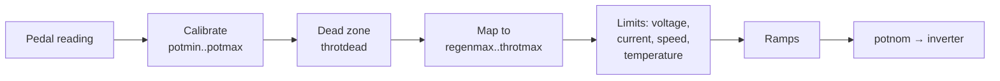

# Throttle, regen and direction

## How pedal position becomes torque

1. **Calibration.** The raw reading `pot` is scaled so `potmin` = 0 % and `potmax` =
   100 %. Readings more than 200 counts outside that span are treated as a fault
   (error `THROTTLE1`/`THROTTLE2`) and give zero torque.
2. **Dead zone.** The first `throtdead` percent of travel does nothing; the rest is
   stretched to 0–100 %.
3. **One-pedal regen.** With the brake off, 0 % pedal requests `regenmax` (negative =
   regen) and 100 % requests `throtmax`. In between it is a straight line. So lifting off
   gives regen, and there is a point in the travel that coasts.
4. **Brake regen.** With the brake input on, the request is `regenBrake` regardless of
   the pedal.
5. **Regen fades with speed.** Full regen is available above `regenrpm`. It fades to zero
   at `regenendrpm` and is always zero below 100 rpm.
6. **Limits** reduce the request (never increase it). `TorqDerate` shows which one is
   active:

    | Limit | Parameter(s) | Effect |
    |---|---|---|
    | Low battery voltage | `udcmin` | Drive torque fades as `udc` approaches it. 0 = off. |
    | High battery voltage | `udclim` | Regen fades as `udc` approaches it. |
    | Battery current | `idcmax`, `idcmin` | Limits discharge and regen current (shunt needed). `idcmax` 0 = off. |
    | Motor speed | `revlim` | Drive torque fades to zero at the limit. |
    | Inverter temperature | `tmphsmax` | 50 % in the first 2 °C above, zero beyond. |
    | Motor temperature | `tmpmmax` | Same. |

7. **Ramps.** Torque increases at most `throtramp` % per 10 ms (only below
   `throtramprpm`). Regen builds at `regenramp` % per 10 ms. Lifting off reduces drive
   torque immediately.

The result is `potnom` (−100 to +100 %). Watch it in the web interface while you tune.

## Dual-channel pedals

Set `potmode = DualChannel` and calibrate `pot2min`/`pot2max`. If the two channels
disagree by more than 10 %, the VCU uses the lower one and caps it at 50 % (limp mode),
and posts `THROTTLE12DIFF`. If one channel is out of range it uses the other.

## Direction

`dir` is the selected direction: 1 drive, −1 reverse, 0 neutral, 2 park. The source, in
priority order:

1. The vehicle class, if it reads the car's own selector (for example Subaru).
2. A CAN gear lever (`GearLvr`).
3. The forward/reverse inputs, interpreted by `dirmode`:

| `dirmode` | Behaviour |
|---|---|
| `Button` (0) | Momentary buttons: press forward for drive, reverse for reverse; the choice is kept. |
| `Switch` (1) | A latching switch: forward input on = drive, reverse on = reverse, neither = neutral. |
| `ButtonReversed` (2), `SwitchReversed` (3) | Same, with forward and reverse swapped. |
| `DefaultForward` (4) | Drive unless the reverse input is on. Both on = neutral. |

Both inputs on at once always selects neutral.

`DirChange` can block a change between forward and reverse unless the motor is below
`DirChangeRpm` (and, in `SpeedBrake` mode, the brake is pressed). `DriveInhibit = Plug
detect` forces neutral while a charge plug is detected.

Throttle is zero in neutral and park. Torque is multiplied by `dir`, so reverse uses the
same pedal map with `throtmaxRev` as its maximum. `revRegen` enables regen in reverse.

## OpenInverter drive units

With `Inverter = OpenI`, the VCU sends the **raw** pedal readings, brake and direction to
the inverter in CAN frame 0x3F. The inverter board applies its **own** pedal calibration,
regen, current limits and ramps. So:

- Calibrate the pedal and set regen and current limits **on the inverter board**.
- The VCU's `throtmax`, `regenmax`, `udcmin`, `idcmax` and friends do not change the
  motor's torque in this mode (the VCU still calculates `potnom` for display).
- The VCU's `potmin` still matters: it decides whether the pedal is "released" for
  starting.
- To reverse motor rotation, change the direction setting **on the inverter board**, not
  the VCU's `dirmode`: changing the VCU side also changes what it reports to the car
  (gear display, reverse lights).

## Cruise control

Cruise buttons are only read through vehicle classes that provide them (for example
Subaru). The cruise speed logic runs (`cruisespeed`), but in V2.41A the cruise throttle
is not applied to the torque request. With cruise off, the Set/Resume buttons step
`regenlevel` down/up.

## Regen brake light

`RegenBrakeLight` (negative %) turns on the `BrakeLight` output when regen is stronger
than that value.
